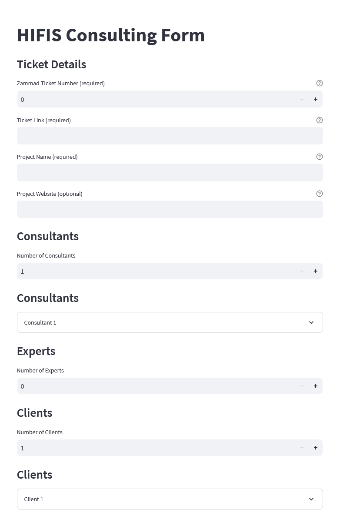

# Consulting Reports Toolkit

This repository holds all compiled consulting reports.

Final reports are saved within the *reports* folder.
The [template report](templates/structured_report_template.yml) and the [template description](templates/README.md) can be found in the *templates* folder.


<!--===============-->
<!--=== SECTION ===-->
<!--===============-->
## License

## Contribute a report

Please follow these steps to compile one or more reports:

1. Create a new branch directly from master branch and create a merge request (optionally use an issue).
2. Copy the [template report](templates/structured_report_template.yml) into the `reports` folder.
3. Rename and file report.
4. (Optional) Request review.
5. Merge when the pipeline is green.

> ℹ️ The [Consulting Handbook](https://hifis.net/consulting-handbook/) gives you more information on how the report is structured.


### Prerequisites

- Install [Poetry](https://python-poetry.org/docs/#installation), as a dependency manager for this project.


### Installation

#### In your `poetry` project

- Navigate to the root of your `poetry` project

- Add reporting source URL to your `poetry` project

    ```
    $ poetry source add \
        --priority=supplemental \
        creporting \
        https://codebase.helmholtz.cloud/api/v4/projects/5219/packages/pypi/simple
    ```

- Install the package

    ```
    $ poetry add --source creporting reporting
    ```

#### In your python project via `pip`

- Using the `pip` command

    ```
    $ pip install reporting --index-url https://codebase.helmholtz.cloud/api/v4/projects/5219/packages/pypi/simple
    ```


#### Utilizing the repo

1. Navigate to the repository directory.
2. Install the CLI dependencies and create a virtual environment for the project by running:

    ``` bash
    $ poetry install --only main
    ```


### Usage via CLI

This project includes a CLI app for validating, linting, and generating a software engineering consulting report. The project uses Poetry for dependency management and packaging.

**Syntax**

```
$ reporting [OPTIONS] COMMAND [ARGS] ...
```

| COMMANDs   | Description                                                 |
| -----      | -----                                                       |
| `analysis` | Extract most import information for reporting.              |
| `create`   | Creates a report via a HTML interface                       |
| `lint`     | Checks if the yaml files are linted correctly.              |
| `plot`     | Creates a HTML with plots based on the CLI analysis output. |
| `validate` | Validates the overall consistency of the presented reports. |

More information on the command line interface (CLI):

``` bash
$ poetry run reporting --help
```


╭─ Options ────────────────────────────────────────────────────────────────────────────────╮
│ --install-completion          Install completion for the current shell.                  │
│ --show-completion             Show completion for the current shell, to copy it or       │
│                               customize the installation.                                │
│ --help                        Show this message and exit.                                │
╰──────────────────────────────────────────────────────────────────────────────────────────╯
╭─ Commands ───────────────────────────────────────────────────────────────────────────────╮
│ analysis   Extract most import information for reporting.                                │
│ create     Creates a report via a HTML interface                                         │
│ lint       Checks if the yaml files are linted correctly.                                │
│ plot       Creates a HTML with plots based on the CLI analysis output.                   │
│ validate   Validates the overall consistency of the presented reports.                   │
╰──────────────────────────────────────────────────────────────────────────────────────────╯

**Example Usage**

```
$ reporting analysis
$ reporting lint
$ reporting validate
``` 


#### `analysis` Command

Generates basic statistics in the standard output for the provided YAML report files in a specified 'report' directory. You can specify it via the `--reports PATH` argument. 

```
$ reporting analysis --help

 Usage: reporting analysis [OPTIONS]                                           

 Extract most import information for reporting.                                

╭─ Options ───────────────────────────────────────────────────────────────────╮
│ --reports        PATH     [default: reports]                                │
│ --year           INTEGER  [default: 2024]                                   │
│ --center         TEXT     [default: all]                                    │
│ --help                    Show this message and exit.                       │
╰─────────────────────────────────────────────────────────────────────────────╯
```

#### `create` Command

When using:

```
$ reporting create
```

a browser window should open automatically that displays the form. Alternatively, you can manually open a browser and enter the address that is displayed in the console.




#### `lint` Command

Lint report files using a specified YAML linter configuration. This function checks the correctness of YAML report files using a specified YAML lint configuration. A table of linter errors is displayed for each file containing errors. The function exits with a non-zero exit code if any errors are found.

```
$>> reporting lint --help

 Usage: reporting lint [OPTIONS]                                               

 Checks if the yaml files are linted correctly.                                

╭─ Options ───────────────────────────────────────────────────────────────────╮
│ --reports              PATH  [default: reports]                             │
│ --linter-config        PATH  [default: .yamllint.yml]                       │
│ --help                       Show this message and exit.                    │
╰─────────────────────────────────────────────────────────────────────────────╯
```


#### `plot` Command

Generates a visual output for the provided YAML report files in a specified 'report' directory. You can specify it via the `--reports PATH` argument. The report consists of several plots, which visualize different aspects of the data, such as the number of reports per category, the number of reports per technology used, and the average workload distribution. The generated report is saved as an HTML file with the specified destination path.

When utilizing the `plot` command you have the following options available:

```
 Usage: reporting plot [OPTIONS]                                     

 Creates a HTML with plots based on the CLI analysis output.         

╭─ Options ───────────────────────────────────────────────────────────────────╮
│ --destination        FILE     [default: reports.html]                       │
│ --reports            PATH     [default: reports]                            │
│ --year               INTEGER  [default: 2024]                               │
│ --center             TEXT     [default: all]                                │
│ --help                        Show this message and exit.                   │
╰─────────────────────────────────────────────────────────────────────────────╯
```

**Example**

```
$ reporting plot --year 2023 --center DLR
```


#### `validate` Command

Validate report files against a JSON schema. This function checks the correctness and validity of report YAML files against a JSON schema. It prints validation results and exits with a non-zero exit code if any errors are found.

```
$>> reporting validate --help

 Usage: reporting validate [OPTIONS]                                           

 Validates the overall consistency of the presented reports.                   

╭─ Options ───────────────────────────────────────────────────────────────────╮
│ --reports                      PATH  [default: reports]                     │
│ --schema-reference-file        PATH  [default:                              │
│                                      templates/consultation-report.schema.… │
│ --help                               Show this message and exit.            │
╰─────────────────────────────────────────────────────────────────────────────╯
```


### Usage of the library

After installing the package in your python environment your can access `cr_analysis`.

!!! example
    ``` python
    import cr_analysis
    cr_analysis.reports_validation(
        reports='./reports/', 
        schema_file="./templates/consultation-report.schema.json"
    )

    dataset = cr_analysis.reports_analysis(
        reports='./reports/',
        year=2023
    )
    ```

`dataset` stores the requested information in a pandas dataframe. With this you can simply create different analysis and output formats. 


<!--===============-->
<!--=== SECTION ===-->
<!--===============-->
## License

Please see the file [LICENSE.md](LICENSE.md) for further information about how the content is licensed.

For extracting license information of any `FILE`, use:

``` sh
$ poetry install --only dev
$ poetry run reuse --suppress-deprecation spdx | grep --after-context 5 FILE
```

The license information are stored in `.reuse/dep5`.

To check the compliance of the project with REUSE version 3, you run the following:

```
$ poetry run reuse lint
```

